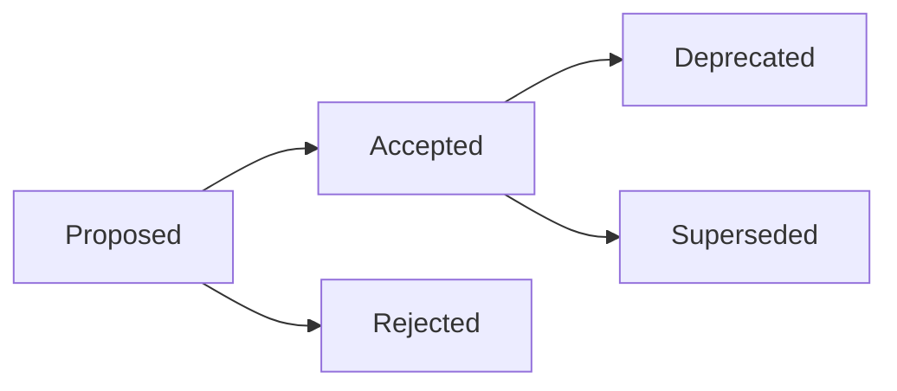

# Architecture Decision Records (ADR)

This directory documents the Architectural Decision Records (ADRs) for `tff` (Transformation Fitness Functions).

An Architecture Decision Record captures an important architectural decision made along with its context, options considered, and consequences.

---

## Decision Log

| ADR | Title | Status | Date |
| :-- | :---- | :----- | :--- |
| [ADR-0001](0001-monorepo-and-provider-adapter-pattern.md) | Monorepo and Provider Adapter Pattern | Accepted | 2026-10-10 |
| [ADR-0002](0002-parallel-ast-caching.md) | Parallel AST Caching Strategy | Accepted | 2026-10-10 |
| [ADR-0003](0003-layer-inference-conventions.md) | Layer Inference and Hierarchy Conventions | Accepted | 2026-10-10 |

---

## ADR Process and Lifecycle

We follow the MADR (Markdown Architectural Decision Records) structure adapted to `tff` engineering standards.

### Lifecycle States

ADRs move through a defined lifecycle:

- **Proposed**: The decision is under active discussion, RFC review, or prototyping.
- **Accepted**: The decision has been agreed upon and adopted by the project maintainers.
- **Rejected**: The proposal was evaluated and decided against.
- **Deprecated**: The decision was previously accepted but is no longer recommended or relevant.
- **Superseded**: The decision has been replaced by a subsequent ADR (must reference the successor ADR).



---

## Proposing a New ADR

1. Copy the template:
   ```bash
   cp docs/adr/template.md docs/adr/NNNN-short-title.md
   ```
   where `NNNN` is the next sequential 4-digit number.
2. Fill out all sections adhering to technical, declarative prose.
3. Open a Pull Request for review with title format: `docs(adr): propose ADR-NNNN <title>`.
4. Update the Decision Log table in `docs/adr/README.md`.
