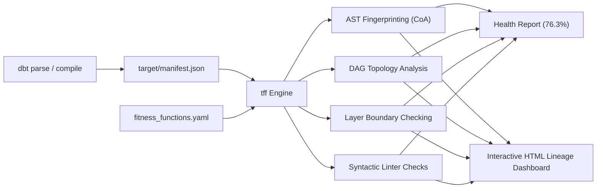

# Case Study: Auditing GitLab's 2,200-Model dbt Architecture

This case study documents a real-world architectural health audit conducted with **Transformation Fitness Functions (TFF)** against GitLab's enterprise data warehouse dbt project.

The goal of this audit was to evaluate how TFF's static analysis, connascence detection, and fitness rules perform on one of the largest and most mature open-source dbt repositories in the modern data ecosystem.

---

## 📌 Executive Summary

* **Target Project**: GitLab Data Team’s enterprise Snowflake dbt repository.
* **Scope**: 2,213 dbt models across 5 architectural layers.
* **Execution Time**: **~13 seconds** locally on a standard laptop.
* **Cost**: **$0.00** (Zero database connection required; zero Snowflake credits consumed).
* **Overall Project Health Score**: **76.3%** across 19 active fitness checks.
* **Primary Discoveries**:
  * **54 duplicated CTE algorithms** copied verbatim across up to 8 separate models.
  * **111 architectural layer integrity errors**, including reverse dependencies and cross-mart coupling.
  * Critical blast-radius hubs with up to **129 downstream dependents** (`dim_date`).
  * **1,409 models** (>63%) with `SELECT *` statements outside staging/source layers.

---

## 🏢 GitHub Source & Project Profile

### Source Repository
* **Repository**: [GitLab Data Team / analytics](https://gitlab.com/gitlab-data/analytics) (Public mirror / fork: [tconbeer/gitlab-analytics-sqlfmt](https://github.com/tconbeer/gitlab-analytics-sqlfmt))
* **Target Directory**: `transform/snowflake-dbt`
* **Target Engine / Dialect**: `dbt-core` with `dbt-snowflake`
* **Total Active Models**: 2,213 models

### Architectural Structure
GitLab organizes its models into an enterprise multi-tier hierarchy:
1. `models/sources`: Ingested raw source definitions and extracts.
2. `models/common_prep`: Low-level preparation and cleaning tables.
3. `models/common`: Dimensional models (`dim_*`) and normalized business facts (`fct_*`).
4. `models/marts`: Domain-specific business marts (`marts/marketing`, `marts/sales_funnel`, `marts/finance`, `marts/product`).
5. `models/workspaces`: Ad-hoc exploration and business-unit specific reporting.

---

## 🔬 Methodology

Traditional data warehouse linting solutions (such as `dbt-project-evaluator` packages) typically run dynamically inside the target cloud warehouse by compiling SQL into temporary views or tables. While functional, this approach requires live warehouse credentials, incurs cloud compute costs, and runs slowly on large repositories.

TFF adopts a **100% static analysis methodology**:



### 1. Zero-Credential Ingestion
The dbt project is compiled locally via `dbt parse` or `dbt compile`. TFF parses `target/manifest.json`, ingesting the dependency DAG, model definitions, SQL source, and test schemas into an in-memory normalized graph representation.

### 2. AST Fingerprinting (Connascence of Algorithm)
To detect duplicated logic across models without executing SQL:
* TFF parses SQL queries and Common Table Expressions (CTEs) into Abstract Syntax Trees (ASTs) using `sqlglot`.
* Query ASTs are normalized (stripping aliases and trivial formatting) and hashed.
* When CTE blocks with 12 or more AST nodes produce identical hashes in separate models, TFF flags them as **Connascence of Algorithm (CoA)** violations.

### 3. Topological Graph Traversal
TFF computes graph-theoretic properties across the 2,213 models:
* **Fan-Out (Blast Radius)**: The count of direct downstream dependents. Models with excessive fan-out represent single points of operational risk.
* **Fan-In (Coupling Sink)**: The count of direct upstream dependencies. Models with excessive fan-in represent bottleneck consolidators.

### 4. Layer & Domain Boundary Validation
Using the configured layer order (`sources` → `common_prep` → `common` → `marts` → `workspaces`):
* TFF inspects every edge in the dependency graph.
* Any edge pointing backwards (e.g. a model in `common_prep` querying a model in `common`) is flagged as a layer inversion error.
* Custom domain isolation boundaries flag horizontal cross-coupling between isolated marts.

---

## 📊 Audit Outcomes

### Overall Health Score: **76.3%**

```
╭───────────────────────── TFF PROJECT HEALTH REPORT ──────────────────────────╮
│                                                                              │
│  Overall Project Health Score: 76.3%                                         │
│  Models Checked: 2,213  ·  Active Checks: 19  ·  Categories: 8               │
│                                                                              │
╰──────────────────────────────────────────────────────────────────────────────╯

Health Score by Category
────────────────────────────────────────────────────────────────────────────────
Category                             Checks   Errors   Warnings    Score
────────────────────────────────────────────────────────────────────────────────
Connascence of Name (CoN)             4/6      1,470          ·    92.6%
Connascence of Type (CoT)             2/2          ·          ·   100.0%
Connascence of Position (CoP)         1/1         37          ·    98.5%
Connascence of Meaning (CoM)          1/1          ·          ·   100.0%
Connascence of Algorithm (CoA)        1/1          ·         54    98.8%
Connascence of Value (CoV)            1/1          ·      1,206    88.3%
Dynamic Coupling & DAG Structure      5/5        114         18    50.0%
Quality & Metadata                    4/7      3,451          ·    61.0%
────────────────────────────────────────────────────────────────────────────────
```

---

## 🔍 Key Architectural Discoveries

### 1. Duplicated Algorithms (Connascence of Algorithm — CoA)
TFF detected **54 cases of complex CTE transformation logic copied verbatim across distinct models**.

* **`accepted_solutions.sql`**: The `parsed` CTE transformation logic was duplicated across **8 separate models**:
  * `daily_engaged_users.sql`
  * `posts.sql`
  * `signups.sql`
  * `time_to_first_response.sql`
  * `topics_with_no_response.sql`
  * `visits.sql`
  * `page_view_total_reqs.sql`
  * `accepted_solutions.sql`
* **`bamboohr_custom_bonus_source.sql`**: The `intermediate` parsing logic was copied across **7 other BambooHR models** (`bamboohr_emergency_contacts_source.sql`, `bamboohr_job_info_source.sql`, `engineering_development_team_members.sql`, etc.).

> **Architectural Impact**: If the business definition of "accepted solution" or BambooHR schema changes, engineers must locate and update 8 different models manually. If one is missed, reporting silent logic drift occurs.
>
> **Recommended Solution**: Extract this logic into an upstream intermediate staging model (e.g. `prep_accepted_solutions.sql`) or a reusable dbt macro.

---

### 2. DAG Layer Integrity Violations
TFF caught **111 architectural layer violations** where data flow violated organizational boundaries:

#### A. Inverted Upstream Dependencies (Downstream Leaks)
Preparation models in `models/common_prep` were found directly referencing downstream presentation models in `models/common`:
* `prep_action` (`common_prep`) → depends on `dim_date` and `dim_namespace_plan_hist` (`common`).
* `prep_board` (`common_prep`) → depends on `dim_project` and `dim_date` (`common`).
* `prep_issue` (`common_prep`) → depends on `dim_project` and `dim_namespace_plan_hist` (`common`).

#### B. Cross-Mart Coupling
Models within one business domain mart were directly depending on internal models belonging to another domain mart:
* `mart_crm_attribution_touchpoint` (`marts/marketing`) directly depends on `mart_crm_opportunity` (`marts/sales_funnel`).

> **Architectural Impact**: Layer inversions create circular dependencies, break modular rebuilds, and make parallel orchestration difficult. Cross-mart coupling tightly binds independent business domains together.

---

### 3. Blast-Radius Hub Models & Bottlenecks
Using graph degree analysis, TFF identified high-risk architectural bottlenecks:

#### High Blast-Radius Hubs (Excessive Fan-Out)
A change to the schema or logic of these models triggers massive cascade rebuilds:
* `dim_date`: **129 downstream dependents** (`fan_out = 129`).
* `date_details`: **42 downstream dependents** (`fan_out = 42`).
* `dim_crm_account`: **39 downstream dependents** (`fan_out = 39`).

#### High-Coupling Sinks (Excessive Fan-In)
These models aggregate huge numbers of upstream dependencies:
* `gitlab_dotcom_tables_date`: **113 upstream models** (`fan_in = 113`).
* `pgp_snowflake_counts`: **105 upstream models** (`fan_in = 105`).

> **Architectural Impact**: `dim_date` is a critical single point of failure (blast radius of 129 models). High-sink models like `gitlab_dotcom_tables_date` become brittle build bottlenecks that fail whenever any of their 113 upstreams fail.

---

### 4. Code Quality & Governance Gaps

* **Coupling by Position (`CoP`)**:
  * **37 models** use positional column references (`GROUP BY 1, 2, 3`).
  * In `bamboohr_budget_vs_actual.sql`, TFF found **21 positional references** in a single statement.
* **`SELECT *` Proliferation**:
  * **1,409 models** (>63% of the repository) use `SELECT *` outside raw extraction layers, creating implicit coupling to upstream table schemas.
* **Testing & Documentation Coverage**:
  * **1,471 models** lack `unique` assertions on their primary keys.
  * **1,133 models** lack `not_null` assertions.
  * **757 models** have no description documented in schema YAML.

---

## 🛠️ Step-by-Step Reproduction Guide

To run this exact audit on GitLab's dbt project yourself:

### 1. Clone the GitLab Analytics Repository
```bash
git clone --depth 1 https://github.com/tconbeer/gitlab-analytics-sqlfmt.git gitlab-analytics
cd gitlab-analytics/transform/snowflake-dbt
```

### 2. Compile the Project Manifest
Generate the compiled `target/manifest.json` without needing database access:
```bash
uv run --with dbt-core --with dbt-snowflake dbt parse
```

### 3. Add `fitness_functions.yaml`
Create a `fitness_functions.yaml` in the `transform/snowflake-dbt` root:
```yaml
layers:
  order:
    - sources
    - common_prep
    - common
    - marts
    - workspaces

checks:
  layer_integrity:
    enabled: true
  dependency_graph:
    enabled: true
    fan_out_warn: 25
    fan_out_fail: 50
    fan_in_warn: 20
  duplicate_ctes:
    enabled: true
    severity: warning
    min_ast_nodes: 12

rules:
  ban_select_star:
    enabled: true
  no_positional_group_by_or_order_by:
    enabled: true
  metadata:
    owner: false
    description: true
    grain: false
    unique_values: true
    not_null: true
```

### 4. Execute TFF Commands
```bash
# Calculate overall architecture health score:
uvx tff-core health

# Inspect detailed violations grouped by connascence category:
uvx tff-core lint --group-by connascence

# Generate standalone interactive HTML documentation and lineage graph:
uvx tff-core docs --output gitlab_tff_report.html
```

---

## 💡 Lessons for Data Platform Engineers

1. **Static Analysis is 100x Faster than Dynamic Evaluation**:
   Evaluating 2,213 models in Snowflake with SQL queries takes minutes to hours and consumes warehouse credits. TFF completed the entire evaluation in **13 seconds** on developer hardware.
2. **Duplicated Algorithms Silently Spread**:
   Without AST-level fingerprinting, copy-pasting complex CTEs across models goes unnoticed in peer code reviews until business metrics diverge.
3. **Fitness Functions Belong in CI/CD**:
   Running `tff health --fail-under 80` or `tff lint` in GitHub Actions / GitLab CI prevents layer inversions and blast-radius bottlenecks from entering `main`.
