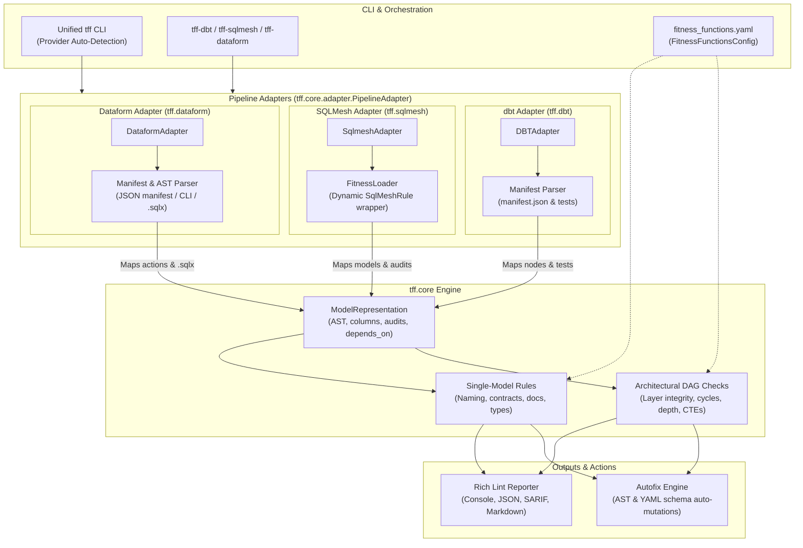

# Contributor & Architecture Guide

Welcome! This document outlines the codebase architecture, package layout, and local development environment setup for tff (Transformation Fitness Functions).

---

## High-Level Architecture

tff is structured to separate the core, adapter-agnostic logic of parsing and checking rules from any specific data orchestrator or engine.



### Core Architecture Components
1. **[tff-core](https://github.com/tjirab/tff/tree/main/packages/tff-core)**: Contains the base model definitions (`ModelRepresentation`), abstract rule and check classes, the built-in rules/checks, the unified `tff` CLI entry point, configuration loader (`fitness_functions.yaml`), reporting engine, and the autofix engine. It also defines the abstract `PipelineAdapter` interface.
2. **dbt Adapter (`tff.dbt`)**: Implements `DBTAdapter`. Parses compile-time artifacts (`manifest.json`) and resolves references, schemas, and tests, mapping them into `ModelRepresentation` objects.
3. **SQLMesh Adapter (`tff.sqlmesh`)**: Implements `SqlmeshAdapter`. Connects directly to SQLMesh contexts, mapping native SQLMesh models into `ModelRepresentation` objects. It also provides `FitnessLoader` to dynamically wrap core rules into native `SqlMeshRule` classes for SQLMesh's built-in linter and CI workflows.
4. **Dataform Adapter (`tff.dataform`)**: Implements `DataformAdapter`. Ingests Google Cloud Dataform projects via precompiled JSON manifests, CLI compilation (`dataform compile --json`), or direct static `.sqlx` AST parsing.


---

## Monorepo Layout

```
├── pyproject.toml              # Root workspace settings
├── release-please-config.json  # Release Please configurations
├── packages/
│   ├── tff-core/               # Unified codebase (core, dbt, sqlmesh)
│   └── sqlmesh-ff/             # Deprecated backward compatibility wrapper
```

---

## Local Development Setup

We use **`uv`** to manage local workspaces, virtual environments, and dependencies.

### 1. Initialize Workspace
Clone the repo and sync the project dependencies in editable mode:
```bash
uv sync --all-extras
```

### 2. Run Tests
Execute the entire workspace test suite using `pytest`:
```bash
uv run pytest
```

### 3. Coverage & Linting
Verify test coverage and run lint rules:
```bash
# Run tests and generate coverage report:
uv run pytest --cov=packages --cov-report=xml

# Check diff coverage against main branch (100% required in PRs):
uv run diff-cover coverage.xml --compare-branch=origin/main --fail-under=100

# Run linting check:
uv run ruff check .
```

---

## Releases & PR Titles

Reases are managed by Google's `release-please` action. 

Your PR titles **must** use the [Conventional Commits](https://www.conventionalcommits.org/) format so that minor/patch versions are calculated correctly:
* `feat: ...` (bumps minor version, e.g., `0.2.0` $\rightarrow$ `0.3.0`)
* `fix: ...` (bumps patch version, e.g., `0.2.0` $\rightarrow$ `0.2.1`)
* `chore: ...`, `docs: ...`, `test: ...` (non-bumping metadata changes)
