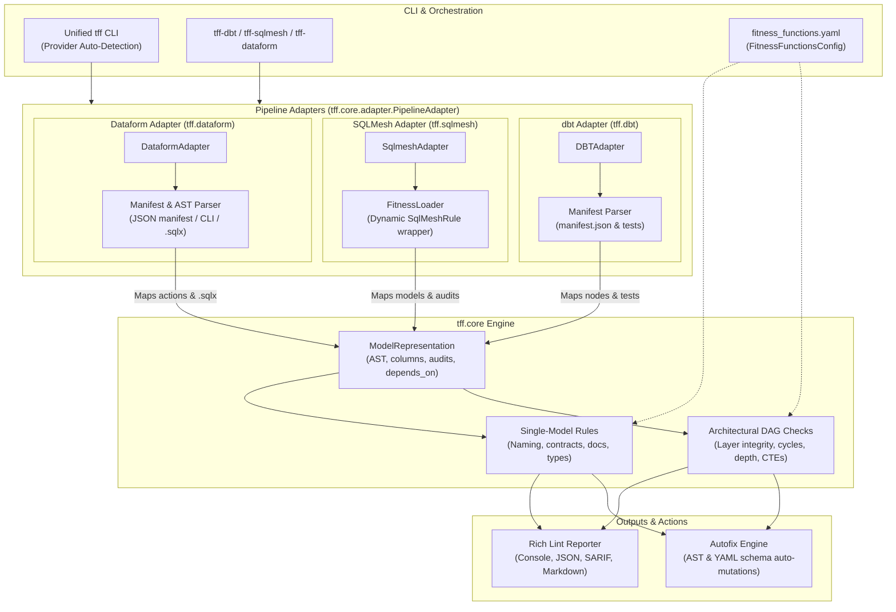
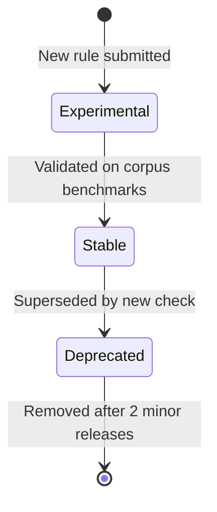

# Contributor & Architecture Guide

Welcome! This document outlines the codebase architecture, package layout, and local development environment setup for tff (Transformation Fitness Functions).

---

## High-Level Architecture

tff is structured to separate the core, adapter-agnostic logic of parsing and checking rules from any specific data orchestrator or engine.


```mermaid
flowchart TD
    subgraph CLI ["CLI & Orchestration"]
        TFF_CLI["Unified tff CLI<br/>(Provider Auto-Detection)"]
        Legacy_CLI["tff-dbt / tff-sqlmesh / tff-dataform"]
        Config["fitness_functions.yaml<br/>(FitnessFunctionsConfig)"]
    end

    subgraph Adapters ["Pipeline Adapters (tff.core.adapter.PipelineAdapter)"]
        direction TB
        subgraph DBT_Box ["dbt Adapter (tff.dbt)"]
            DBT_Ad["DBTAdapter"]
            DBT_Parser["Manifest Parser<br/>(manifest.json & tests)"]
            DBT_Ad --> DBT_Parser
        end

        subgraph SM_Box ["SQLMesh Adapter (tff.sqlmesh)"]
            SM_Ad["SqlmeshAdapter"]
            SM_Loader["FitnessLoader<br/>(Dynamic SqlMeshRule wrapper)"]
            SM_Ad --> SM_Loader
        end

        subgraph DF_Box ["Dataform Adapter (tff.dataform)"]
            DF_Ad["DataformAdapter"]
            DF_Parser["Manifest & AST Parser<br/>(JSON manifest / CLI / .sqlx)"]
            DF_Ad --> DF_Parser
        end
    end

    subgraph Core ["tff.core Engine"]
        Model["ModelRepresentation<br/>(AST, columns, audits, depends_on)"]
        Rules["Single-Model Rules<br/>(Naming, contracts, docs, types)"]
        Checks["Architectural DAG Checks<br/>(Layer integrity, cycles, depth, CTEs)"]
    end

    subgraph Outputs ["Outputs & Actions"]
        Reporter["Rich Lint Reporter<br/>(Console, JSON, SARIF, Markdown)"]
        Autofix["Autofix Engine<br/>(AST & YAML schema auto-mutations)"]
    end

    TFF_CLI --> Adapters
    Legacy_CLI --> Adapters
    Config -.-> Rules
    Config -.-> Checks

    DBT_Parser -->|"Maps nodes & tests"| Model
    SM_Loader -->|"Maps models & audits"| Model
    DF_Parser -->|"Maps actions & .sqlx"| Model

    Model --> Rules
    Model --> Checks

    Rules --> Reporter
    Checks --> Reporter
    Rules --> Autofix
    Checks --> Autofix
```

### Core Architecture Components
1. **[tff-core](https://github.com/tjirab/tff/tree/main/packages/tff-core)**: Contains the base model definitions (`ModelRepresentation`), abstract rule and check classes, the built-in rules/checks, the unified `tff` CLI entry point, configuration loader (`fitness_functions.yaml`), reporting engine, and the autofix engine. It also defines the abstract `PipelineAdapter` interface.
2. **dbt Adapter (`tff.dbt`)**: Implements `DBTAdapter`. Parses compile-time artifacts (`manifest.json`) and resolves references, schemas, and tests, mapping them into `ModelRepresentation` objects.
3. **SQLMesh Adapter (`tff.sqlmesh`)**: Implements `SqlmeshAdapter`. Connects directly to SQLMesh contexts, mapping native SQLMesh models into `ModelRepresentation` objects. It also provides `FitnessLoader` to dynamically wrap core rules into native `SqlMeshRule` classes for SQLMesh's built-in linter and CI workflows.
4. **Dataform Adapter (`tff.dataform`)**: Implements `DataformAdapter`. Ingests Google Cloud Dataform projects via precompiled JSON manifests, CLI compilation (`dataform compile --json`), or direct static `.sqlx` AST parsing.
5. **Custom Extensions & Adapters**: See the [Extending tff Guide](extending_tff.md) for how to implement proprietary rules, architectural DAG checks, and pipeline adapters.


---

## Monorepo Layout

```
├── pyproject.toml              # Root workspace settings
├── release-please-config.json  # Release Please configurations
├── packages/
│   ├── tff-core/               # Unified codebase (core, dbt, sqlmesh)
│   └── sqlmesh-ff/             # Deprecated backward compatibility wrapper
```

---

## Local Development Setup

We use **`uv`** to manage local workspaces, virtual environments, and dependencies.

### 1. Initialize Workspace
Clone the repo and sync the project dependencies in editable mode:
```bash
uv sync --all-extras
```

### 2. Run Tests
Execute the entire workspace test suite using `pytest`:
```bash
uv run pytest
```

### 3. Coverage & Linting
Verify test coverage and run lint rules:
```bash
# Run tests and generate coverage report:
uv run pytest --cov=packages --cov-report=xml

# Check diff coverage against main branch (100% required in PRs):
uv run diff-cover coverage.xml --compare-branch=origin/main --fail-under=100

# Run linting check:
uv run ruff check .
```

### 4. Performance Benchmarks & Corpus Verification
Ensure changes do not cause performance regressions or false positives:
```bash
# Run performance benchmark against SLA ceiling (default 15.0s):
uv run python scripts/benchmark.py --max-seconds 15.0

# Run corpus snapshot regression tests:
uv run pytest packages/tff-core/tests/test_corpus_snapshots.py
```

---

## Testing Architecture & Anti-Bloat Guidelines

Tests must be robust, concise, and direct. Contributors and automated agents must adhere to the following testing standards to prevent brittle presentation coupling, test-to-code LOC bloat, and redundant boilerplate.

### Core Testing Principles

1. **Pure Core, Thin Shell**:
   - **Business logic is tested via pure data transformations**: Rules, DAG analyses, AST transformations, and diagnostic collectors must be tested with direct inputs and outputs (native Python dictionaries, lists, or dataclasses).
   - **Presentation formatters are tested via minimal smoke tests**: Renderers (Rich console tables, ANSI stylers, SARIF formatters, PR comment markdown) should only have focused smoke tests verifying table structure or markup tags.
   - **Never assert business logic via terminal string scraping**: Do not parse ANSI escape sequences or scrape Rich console terminal output buffers to verify whether a rule triggered, what severity was assigned, or which model was flagged.

2. **Mandatory Parametrization**:
   - Permutation and boundary tests must use `@pytest.mark.parametrize`.
   - Never write dozens of near-identical standalone test functions that vary only by a literal input or expected outcome.

3. **Lightweight Test Factories**:
   - Use shared factory fixtures (`_make_finding`, `_make_model` from `conftest.py`) instead of manually instantiating raw dataclasses or repetitive dictionary fixtures.
   - Only supply fields relevant to the specific test scenario; allow defaults to handle the rest.

4. **LOC Proportionality (Anti-Bloat)**:
   - Keep test volume proportional to feature complexity. A 30-line logic change should not generate 250+ lines of redundant test assertions.

---

### Before & After Examples

#### 1. Pure Core vs. Presentation Shell Coupling

Coupling business logic validation to terminal formatters produces brittle tests that break on minor cosmetic changes (e.g. padding, colors, or header labels).

```python
# [FAIL] Bloated / Coupled: Scraping Rich terminal output to verify business logic
def test_severity_filter_via_rich_console():
    from rich.console import Console
    from tff.core.report import render_lint_report, LintFinding

    console = Console(record=True, width=120)
    findings = [
        LintFinding(
            check="banselectstar",
            severity="error",
            message="SELECT * is prohibited.",
            model="marts.users",
            path="models/marts/users.sql",
            line=1,
            col=1,
        )
    ]
    
    # Running full presentation layer to test underlying filter logic
    render_lint_report(findings, models_checked=1, executed_checks=["banselectstar"], console=console)
    output = console.export_text()
    
    # Brittle terminal string scraping:
    assert "banselectstar" in output
    assert "SELECT * is prohibited" in output
    assert "models/marts/users.sql:1:1" in output
```

```python
# [PASS] Concise / Decoupled: Pure core unit assertion + minimal shell smoke test
from conftest import _make_finding
from tff.core.report import _format_check_cell, render_lint_report

# 1. Pure unit test on transformation logic
def test_format_check_cell_known_rule():
    cell = _format_check_cell("banselectstar")
    assert "banselectstar" in cell

# 2. Minimal smoke test for presentation renderer interface
def test_render_lint_report_smoke():
    from rich.console import Console

    console = Console(record=True, width=120)
    findings = [_make_finding(check="banselectstar", model="marts.users")]
    success = render_lint_report(findings, models_checked=1, executed_checks=["banselectstar"], console=console)
    
    assert success is False
    assert "TFF ARCHITECTURE AUDIT" in console.export_text()
```

#### 2. Parametrized Matrix vs. Repetitive Test Functions

Avoid declaring multiple repetitive functions that assert simple variations.

```python
# [FAIL] Bloated: Repetitive individual test functions
def test_summary_shows_executed_check():
    names = _summary_check_names(["layer_integrity"], {})
    assert names == ["layer_integrity"]

def test_summary_expands_sqlmesh_when_empty():
    names = _summary_check_names(["sqlmesh"], {})
    assert set(names) == {"classificationmacros", "sqlcomplexity"}

def test_summary_uses_finding_rule_names():
    by_check = {"nomissinggrain": {"error": 2, "warning": 0}}
    names = _summary_check_names(["sqlmesh"], by_check)
    assert names == ["nomissinggrain"]
```

```python
# [PASS] Concise: Single parametrized test matrix
import pytest
from tff.core.report import _summary_check_names

@pytest.mark.parametrize(
    ("executed", "by_check", "expected"),
    [
        (["layer_integrity"], {}, {"layer_integrity"}),
        (["sqlmesh"], {}, {"classificationmacros", "sqlcomplexity"}),
        (["sqlmesh"], {"nomissinggrain": {"error": 2, "warning": 0}}, {"nomissinggrain"}),
    ],
)
def test_summary_check_names(executed: list[str], by_check: dict, expected: set[str]) -> None:
    assert set(_summary_check_names(executed, by_check)) == expected
```

#### 3. Test Factory Usage vs. Raw Instantiation Boilerplate

Manual object construction with redundant default fields clutters test files and increases maintenance burden when dataclass signatures change.

```python
# [FAIL] Bloated: Repetitive verbose dataclass construction
from tff.core.model import ModelRepresentation
from tff.core.report import LintFinding

def test_finding_evaluation():
    finding = LintFinding(
        check="banselectstar",
        severity="error",
        message="SELECT * is prohibited.",
        model="marts.orders",
        path="models/marts/orders.sql",
        line=10,
        col=5,
        end_line=10,
        end_col=15,
        rule_id="banselectstar",
        fix_available=False,
    )
    assert finding.model == "marts.orders"
```

```python
# [PASS] Concise: Lightweight test factories with sensible defaults
from conftest import _make_finding, _make_model

def test_finding_evaluation():
    # Only specify what this specific test cares about:
    finding = _make_finding(model="marts.orders")
    assert finding.model == "marts.orders"

def test_model_representation():
    model = _make_model(name="stg_orders", materialized="view")
    assert model.materialized == "view"
```

---

## Strategic Guardrails & Product Boundaries

To keep `tff` focused and reliable as it evolves, all contributions must adhere to our product constitution:

### 1. Core Focus vs. Anti-Goals
* **What tff IS**: A compile-time DAG architecture, coupling, and modularity fitness tool. It enforces layer boundaries, Connascence of Algorithm (duplicate transformation CTEs), domain ownership, and schema contracts.
* **What tff is NOT**:
  * **Not a syntax or formatting linter**: Formatting, trailing commas, and keyword case belong to [SQLFluff](https://sqlfluff.com/) or [Ruff](https://astral.sh/ruff).
  * **Not a runtime data assertion engine**: Row counts, null checks on live tables, and distribution assertions belong to dbt tests, Great Expectations, or Soda.
  * **Not an orchestrator**: Pipeline scheduling and execution belongs to Airflow, Dagster, or Cosmos.

### 2. Zero-Config First Run
Any valid dbt, SQLMesh, or Dataform project must yield valuable insights out of the box with `tff check` without requiring manual configuration files. Smart defaults and automatic layer inference (`staging` → `intermediate` → `core` → `marts`) must always work.

### 3. Actionability Over Identification
Checks must never produce vague warnings. Every violation should include actionable remediation instructions (e.g., target layer recommendations, CTE deduplication guidance, or automated fixes via `tff autofix`).

---

## Rule Lifecycle & Acceptance Checklist

To avoid user alert fatigue and maintain confidence across CI pipelines, rules progress through three lifecycle stages:


```mermaid
stateDiagram-v2
    [*] --> Experimental: New rule submitted
    Experimental --> Stable: Validated on corpus benchmarks
    Stable --> Deprecated: Superseded by new check
    Deprecated --> [*]: Removed after 2 minor releases
```

* **`experimental`**: Opt-in or non-blocking (`severity="warning"`). Gathers feedback from real-world repositories without breaking existing CI merge gates.
* **`stable`**: Standard default suite. Covered by strict semantic versioning; rule IDs and diagnostic formats are immutable without deprecation windows.
* **`deprecated`**: Flagged for removal, accompanied by clear migration paths in release notes and CLI messages.

### Pull Request Checklist for New Rules / Checks
Before submitting a new rule or check:
- [ ] **Architectural Justification**: Does it target DAG coupling, layer violations, or logic duplication?
- [ ] **False-Positive Ceiling**: Does it exhibit `< 1%` false positives on our corpus benchmark fixtures (`examples/minimal-*` and real-world projects)?
- [ ] **Engine Parity**: Does it run consistently across dbt, SQLMesh, and Dataform via `tff.core.adapter.PipelineAdapter`?
- [ ] **Actionable Remediation**: Does the error message or `--explain` provide concrete guidance or an autofix?
- [ ] **Coverage**: 100% diff test coverage verified via `diff-cover`.
- [ ] **Test Architecture**: Does the test suite adhere to "Pure Core, Thin Shell" decoupling, use `@pytest.mark.parametrize` for combinatorial cases, and avoid raw boilerplate via test factories?

---

## Releases & PR Titles

Releases are managed by Google's `release-please` action. 

Your PR titles **must** use the [Conventional Commits](https://www.conventionalcommits.org/) format so that minor/patch versions are calculated correctly:
* `feat: ...` (bumps minor version, e.g., `0.2.0` $\rightarrow$ `0.3.0`)
* `fix: ...` (bumps patch version, e.g., `0.2.0` $\rightarrow$ `0.2.1`)
* `chore: ...`, `docs: ...`, `test: ...` (non-bumping metadata changes)
