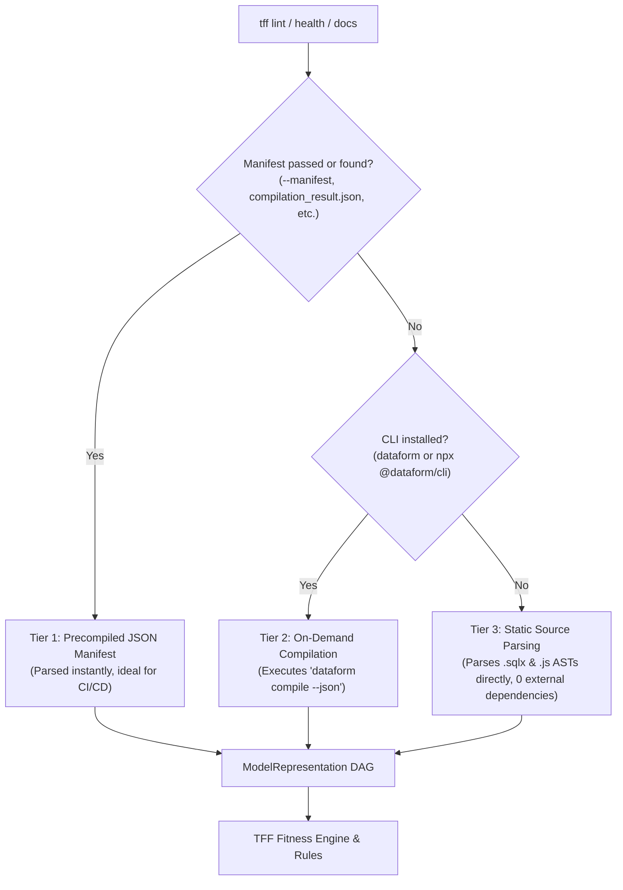

# Using TFF with Google Cloud Dataform

TFF provides first-class support for [Google Cloud Dataform](https://cloud.google.com/dataform) projects. It evaluates architectural boundaries, connascence, schema assertions, and SQL code formatting across Dataform pipelines.

---

## Installation

Install using the `dataform` extra (or bare `tff-core`, since Dataform support has no additional heavy Python dependencies):

```bash
# With uv:
uv add "tff-core[dataform]"

# Or pip:
pip install "tff-core[dataform]"
```

---

## Quick Start

1. Add `fitness_functions.yaml` to your Dataform project root (alongside `workflow_settings.yaml` or `dataform.json`).
2. Run the linter CLI:
   ```bash
   tff lint
   ```
   TFF automatically detects your Dataform project from `workflow_settings.yaml` or `dataform.json`.

---

## How It Works

Dataform projects combine SQL with JavaScript configuration blocks (`config { ... }`), JS includes (`includes/`), and `.sqlx` files. TFF uses a flexible multi-tier ingestion architecture:



### 1. Multi-Tier Model Ingestion
* **Tier 1: Precompiled Manifest**: Inspects precompiled compilation result JSON files. Supports `@dataform/cli` JSON exports and GCP Dataform REST API `compilationResultActions` objects. Can be passed via `--manifest <path>` or auto-discovered if `compilation_result.json` or `compilationResultActions.json` is present.
* **Tier 2: Local CLI Compilation**: If no manifest is provided, TFF attempts to run `dataform compile --json` (or `npx @dataform/cli compile --json`) in the project directory if the CLI is available.
* **Tier 3: Direct Static Source Parsing**: If Node.js / Dataform CLI is not installed (e.g. lightweight Python CI runner), TFF parses `.sqlx` files and `declare()` JavaScript blocks directly, stripping JavaScript placeholders (`${...}`) and parsing SQL with SQLGlot (`dialect: bigquery`).

### 2. Model & Declaration Mapping
* **Tables, Views, and Incremental tables** (`type: "table" | "view" | "incremental"`) are mapped to active models.
* **Inline tables** (`type: "inline"`) are mapped as symbolic models.
* **Declarations** (`type: "declaration"` or JS `declare({ ... })`) are mapped as external models, maintaining the lineage DAG without enforcing internal code style rules.

### 3. Metadata & Label Mapping
TFF extracts model metadata from `.sqlx` config blocks and compilation descriptors:
* **`owner`**: Extracted from `bigquery.labels.owner`, `meta.owner`, or top-level `owner`.
* **`description`**: Extracted from `description` or `actionDescriptor.description`.
* **`columns`**: Extracted from `columns` dictionaries or `actionDescriptor.columns` path types.
* **`tags`**: Extracted from `tags` lists.

### 4. Audits & Assertion Mapping
* Dataform assertions configured via `assertions: { uniqueKey: ["id"], nonNull: ["id"] }` or table-level `uniqueKey` are mapped to audits (such as `unique_values`).
* Standalone `.sqlx` assertions are mapped to audit checks on their referenced upstream tables.

### 5. Layer and Domain Mapping
Dataform organizes models inside `definitions/`. TFF automatically infers layers and domains:
* `definitions/staging/stg_users.sqlx` $\rightarrow$ layer: `staging`
* `definitions/marts/marketing/dim_customers.sqlx` $\rightarrow$ layer: `marts`, domain: `marketing`

This layer and domain structure is evaluated against your `layers.order` configuration and the custom layer isolation boundaries.

---

## CLI Options for Dataform

All unified `tff` CLI commands (`lint`, `health`, `docs`, `info`) work seamlessly with Dataform:

### Linting
```bash
# Auto-detect project and run checks:
tff lint

# Explicit provider:
tff lint --provider dataform

# Use a precompiled compilation result:
tff lint --manifest compilation_result.json

# Automatically fix positional GROUP BY / ORDER BY in .sqlx files:
tff lint --fix
```

### Health & Architecture Score
```bash
# Check overall health score:
tff health

# Group breakdown by domain under definitions/:
tff health --group-by domain

# Restrict scope to marts:
tff health --scope definitions/marts
```

### Interactive Documentation & Dashboard
```bash
tff docs --output site/index.html
```

---

## CI / CD Integration

### GitHub Actions with GCP Dataform Compilation
If your CI workflow fetches the compiled release result from GCP Cloud Dataform or runs `@dataform/cli`:

```yaml
name: TFF Lint
on: [pull_request]

jobs:
  lint:
    runs-on: ubuntu-latest
    steps:
      - uses: actions/checkout@v4
      - uses: actions/setup-node@v4
        with:
          node-version: 20
      - run: npm install -g @dataform/cli
      - run: dataform compile --json > compilation_result.json

      - uses: astral-sh/setup-uv@v3
      - run: uv tool run tff-core lint --manifest compilation_result.json
```

### Lightweight CI without Node.js
If Node.js is not available in your Python runner, TFF can lint directly from static source files:

```yaml
name: TFF Lint
on: [pull_request]

jobs:
  lint:
    runs-on: ubuntu-latest
    steps:
      - uses: actions/checkout@v4
      - uses: astral-sh/setup-uv@v3
      - run: uv tool run tff-core lint
```

---

## Pre-commit Integration

Enforce TFF fitness functions automatically on git commit using [pre-commit](https://pre-commit.com/):

```yaml
# .pre-commit-config.yaml
repos:
  - repo: https://github.com/tjirab/tff
    rev: v0.11.0
    hooks:
      - id: tff-lint
```

The hooks default to bare `tff-core`, which supports Dataform projects out of the box (with zero external Python dependencies for static source parsing or precompiled JSON manifests). If you prefer an explicit declaration in your configuration, you can specify `additional_dependencies: ["tff-core[dataform]"]`:

```yaml
  - repo: https://github.com/tjirab/tff
    rev: v0.11.0
    hooks:
      - id: tff-lint
        additional_dependencies: ["tff-core[dataform]"]
```

---

## GitHub Actions Integration

Automate Dataform fitness functions and post PR summary comments using the official GitHub Action:

```yaml
# .github/workflows/tff.yml
name: TFF Architectural Fitness Functions

on:
  pull_request:
    branches: [ main ]

jobs:
  tff-dataform:
    runs-on: ubuntu-latest
    permissions:
      contents: read
      pull-requests: write  # Required for posting/updating PR comments
    steps:
      - uses: actions/checkout@v4
        with:
          fetch-depth: 0  # Required for health score diff calculation

      - uses: tjirab/tff@v1
        with:
          project: "."
          provider: "dataform"
          fail-under: "80.0"
          fail-level: "error"
          comment-pr: "true"
```
