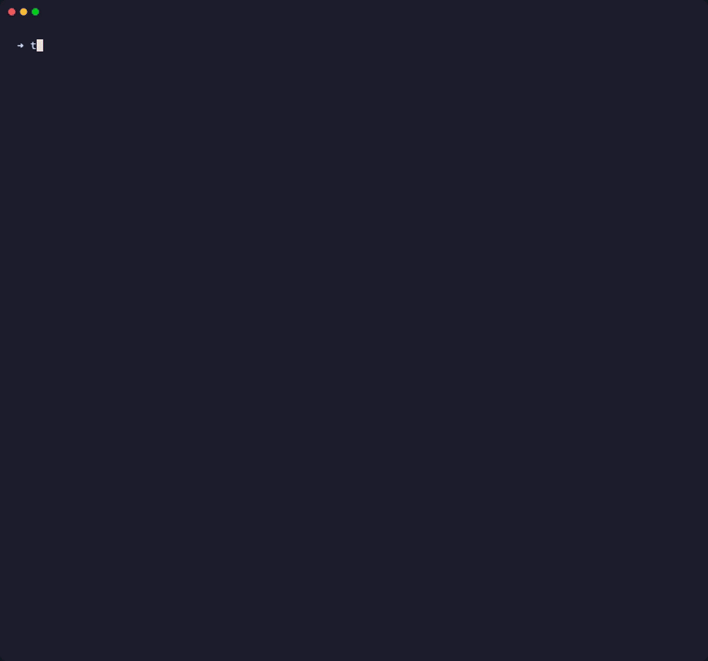

<p align="center">
  
</p>

# Fast, Zero-Warehouse-Cost Architectural Linter & DAG Governance

**Enforce clean boundaries, layer integrity, and logic deduplication for dbt, SQLMesh, and Dataform.**

[](https://pypi.org/project/tff-core/)
[](https://pypi.org/project/tff-core/)
[](https://tff.readthedocs.io/en/latest/?badge=latest)

SQL linters check syntax and indentation in individual files, but they are blind to your DAG architecture. **tff** evaluates your transformation models holistically—catching illegal cross-layer joins, cross-domain coupling, circular dependencies, and duplicate business logic before they merge into production.

<p align="center">
  
</p>

```text
$ tff check

╭──────────────────────────────── LINT FAILED ─────────────────────────────────╮
│  5 models checked  ·  3 errors  ·  4 warnings                                │
╰──────────────────────────────────────────────────────────────────────────────╯

Issues by Model
● marts/marketing/marketing_all_users.sql
  ✘ marts/marketing depends on sqlmesh_example.finance_stats (marts/finance)
    → Illegal cross-layer dependency! (layer_integrity)
  ⚠ CTE 'marketing_cleaned_users' duplicates transformation logic with 3 other models.
    → Connascence of Algorithm: extract into a shared upstream model. (duplicate_ctes)

● marts/finance/finance_stats.sql
  ⚠ CTE 'cleaned_users' duplicates transformation logic with 3 other models.
    → Connascence of Algorithm. (duplicate_ctes)

● core/users.sql
  ✘ SELECT * is prohibited. Explicitly name your columns to reduce coupling. (ban_select_star)
  ✘ Model owner should always be specified. (nomissingowner)

Lint failed — fix errors above before merging.
```

---

## ⚡ 30-Second Evaluation (Zero Config)

Run `tff` inside any existing transformation repository without creating any configuration file. `tff` immediately infers default architectural conventions (`staging` → `intermediate` → `core` → `marts`):

=== "dbt"

    ```bash
    # Instant zero-install invocation:
    uvx --from "tff-core[dbt]" tff check

    # Or install adapter:
    pip install "tff-core[dbt]"

    # Audit existing models for layer violations & duplicate CTEs
    tff check

    # Compute baseline architectural health score (0–100)
    tff health
    ```

=== "SQLMesh"

    ```bash
    # Instant zero-install invocation:
    uvx --from "tff-core[sqlmesh]" tff check

    # Or install adapter:
    pip install "tff-core[sqlmesh]"

    # Audit existing models for layer violations & duplicate CTEs
    tff check

    # Compute baseline architectural health score (0–100)
    tff health
    ```

=== "Dataform"

    ```bash
    # Instant zero-install invocation:
    uvx --from "tff-core[dataform]" tff check

    # Or install adapter:
    pip install "tff-core[dataform]"

    # Audit existing models for layer violations & duplicate CTEs
    tff check

    # Compute baseline architectural health score (0–100)
    tff health
    ```

!!! tip "Zero Configuration Required"
    Running `tff check` out of the box will immediately discover:
    
    * **Cross-layer violations**: Mart models querying raw staging or sources directly, bypassing intermediate layers.
    * **Domain boundary violations**: Models referencing sibling marts without explicit contracts.
    * **Duplicate transformation logic**: Copy-pasted CTE algorithms across disparate models (Connascence of Algorithm).
    * **DAG smells & governance**: Missing ownership, missing assertions, and `SELECT *` usages.

    To customize layer hierarchies or set up custom domain boundaries, run `tff init` to scaffold a `fitness_functions.yaml`.

---

## Quick CLI Usage

Once installed, use the unified `tff` CLI to run linting, calculate health scores, and enforce architectural quality gates:

```bash
# Run architectural fitness checks and linting
tff lint

# Automatically fix simple linting violations
tff lint --fix

# Calculate overall repository health score and enforce quality gate
tff health --fail-under 80

# View detailed environment, adapter, and rule info
tff info
```

For full CLI options and flags, see the [CLI Reference](cli.md).

---

## Documentation Navigation

* 📐 [SQLMesh Integration Guide](sqlmesh.md)
* ⚡ [dbt Integration Guide](dbt.md)
* ☁️ [Dataform Integration Guide](dataform.md)
* 💻 [CLI Reference Guide](cli.md)
* 🔍 [Rules & Checks Reference](rules_and_checks.md)
* 🤖 [CI/CD & GitHub Actions Guide](ci_cd.md)
* 🧩 [Extending tff Guide (Custom Rules, Checks & Adapters)](extending_tff.md)
* 📊 [Case Study: GitLab dbt Audit (2,200+ models)](case_study_gitlab.md)
* 🔌 [API Reference - Adapters](api/adapters.md)
* 📜 [API Reference - Rules & Checks](api/rules.md)
* 🏗️ [Architecture & Contributor Guide](contributing.md)
